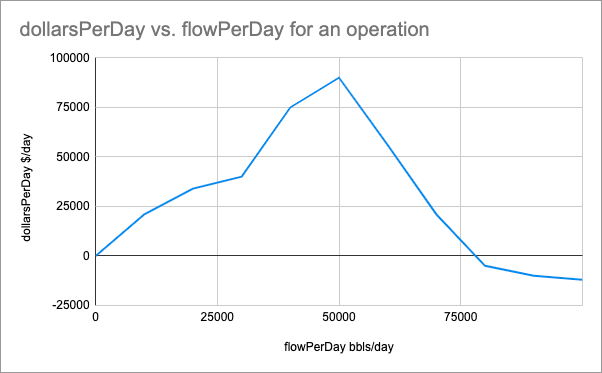

## EOG wells are constantly producing water and we need to find ways to reduce expenditures, as well as reuse and recycle water whenever possible. Your challenge is to use your creativity to develop an application which can process a steady stream of real-time sensor data to both optimize and visualize the distribution of water for our upstream operations! A prize will be awarded to the best team for this category, please come and see the EOG Resources team for more details.

EOG is called an Oil Company, but in a sense we are a water company.  Frequently our wells produce over 4 times as much water as oil per barrel of fluid  (1 bbl = 42 US Gallons).  Managing this water is challenging logistical problem for our industry that requires real time data analysis and tweaks to keep operations flowing.  We pride ourselves on our water reuse programs which allows us to recycle water that we produce to support operations as opposed to using valuable freshwater from nearby ecosystems.

Consider the following: The revenue structure of an operation is not a fixed amount, there are times in which the demand for water increases.  Likewise surplus water beyond a certain point can have diminishing returns.  The points between points on these demand curves should be linearly interpolated.

## Server Data

### Input

The server will send you:

```js
interface ServerRequest {
	flowRateIn:  number;
	operations: WaterOperation[];
	type:  "CURRENT_STATE";
}
```
 - flowRateIn
   - the amount of water flowing into the system
  - operations
    - a list of operations that can use this water
  - type
    - helps you identify the type of message from the server (there are multiple)


The value structure of an operation is defined as an array of points that define the revenue curve for the operation.


```js
interface WaterOperation {
	name:  string,
	id:  string,
	revenueStructure: Point[],
}
```

```js
interface Point {
	flowPerDay:  number,
	dollarsPerDay:  number,
}
```

 ### Output
The server expects the following messages to be sent over the socket connection:

 - An array of the following response(s) from your client:

```js
interface ClientResponse {
	operationId:  string,
	flowRate:  number,
}
```
 - operationId
   - corresponds to an operation from the ServerRequest
 - flowRate
   - the amount of flow allocated to the operation

and will return the following ServerResponse:

```js
interface ServerResponse {
	incrementalValue:  number,
	valuePerDay:  number,
	flowIn:  number,
	totalFlowToOperations:  number,
	type:  "OPTIMATION_RESULT",
}
```
- incrementalRevenue
   - the revenue generated during the last 5 seconds
 - revenuePerDay
   - the Revenue per day at that moment in time.
 - flowIn
   - the flow rate into the system in bbls/day
  - totalFlowToOperations
    - the flow rate out of the system into the operations in bbls/day

## Food for Thought:

 - Data will be streaming in as real time data point
 - A new data point is generated from sensors in the field every 5 seconds.
 - How much water should each location receive?
 - What other kinds of information can you garner from this data?
 - What information would a user of your app want to see?

## Example Project
We hosted an example app here: https://2021-utd-hackathon.azurewebsites.net

You can see the React source code in the "client" folder. It's mainly to give you access to working boilerplate so you can focus on the important stuff. Also the server is open-source if you are curious how it works.

You can start the client by installing node, and then going to the folder and running:
```
yarn install
yarn start
```

You are of course welcome to you use any technology stack and platform you want (But we love great user experiences!)

For python, you can look into this stackoverflow about web sockets. https://stackoverflow.com/questions/3142705/is-there-a-websocket-client-implemented-for-python


## Prizes

The team with the best project will win five Oculus Quest Headsets.

## Bonus!

EOG frequently uses pits to store water. That way we can fill the pit up when the need for water is low and deplete reserves when the need for water is high. Help us determine what the optimal pit size might be for this operation and adjust your algorithm for managing water when a pit exists.

You can initialize a pit by messaging the server with the payload { setPitCapacity: number } on initialization of the socket.

ex:
```js
ws.addEventListener('open',  ()  =>  {
	ws.send(JSON.stringify({setPitCapacity:  100000}));
})
```
Good Luck!
