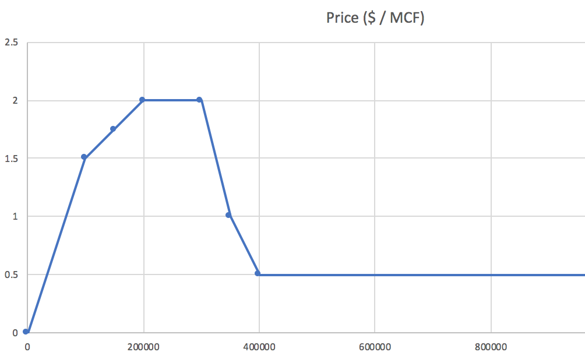

# Problem Statement
EOG wells are producing natural gas and sending it to a compressor station via pipeline. From there, the gas is sent to several different points of sale each with different prices. For example, some points of sale will offer a higher price if you sell more gas because of economies of scale. While others will offer a high price for a small amount of gas, but will offer a very low price for more gas as it reaches capacity. Based on these prices, EOG is constantly changing how gas is distributed to the different points of sale to sell the gas at the highest average price possible.

1) Your job is to build a user interface showing relevant data for someone monitoring this optimization process. This can include things like a chart of total revenue or logs of each time EOG changes the gas distribution.

2) For extra credit, you can optimize how gas is allocated to the points of sale to maximize revenue (the algorithm in the starter code just naively distributes gas evenly to all points of sale).


# User Interface Expectations

We really want this to be an opportunity for you to be creative while also making a user interface that is genuinely useful and intuitive to a real user. However, for the sake of making a concrete requirement, we want atleast one component that displays real time information. But keep in mind the more effort you put in, the more evidence we have of your React skills. Here are some ideas for components to put in the app:

- A list of logs for every time EOG changes how gas is distributed
- A chart showing total revenue over time
- Charts showing the points' of sale price structures
- A schematic representation (think SVG) of the points of sale
- Some sort of interactive component for showing how the optimization is done
- Something we never thought of is a huge bonus!

# Optimization Algorithm Expectations

For bonus points you can improve how EOG distributes gas. The algorithm in the starter code distributes gas very naively and can be improved upon. This is entirely optional but will definitely impress us if you do it well. More information on the technical details of the optimization can be seen below.

# Requirements

- The code should compile and run.
- As data streams from the server, valid responses must be sent back. The template app already implements this (naively), so this is already done!
- The user interface must implemented with React. Besides that, the choice of technologies is up to you!

# How it's graded

- Imagine a real person trying to monitor your app. The user interface should be look good, be intuitive, and display data a real user would want to see. Bonus points for creativity!
- Handle edge cases like error conditions, memory leaks, and resizing the browser window.
- Code shoud be consistently linted, have consistent conventions, and generally be easy to understand.
- Proper use of typescript is preferred over javascript.
- Avoid console errors and warnings
- It's not required but we would love to see the optimization algorithm be improved.

# Technical Details

A websocket will stream a live feed data. This data includes a list of compressors with their pricing structure and the volume of gas in MCF (thousand cubic feet) coming from the compressor station.

Here is an example sales point.

```json
{
  "name": "Station 1",
  "id": "001",
  "prices": [
    {
      "price": 1.50,
      "amount": 100000,
    },
    {
      "price": 1.75,
      "amount": 150000,
    },
    {
      "price": 2.00,
      "amount": 200000,
    },
    {
      "price": 2.00,
      "amount": 300000,
    },
    {
      "price": 1.00,
      "amount": 350000,
    },
    {
      "price": 0.50,
      "amount": 400000,
    },
  ]
}
```

And here is what the chart of that data looks like:




A few things to note.

- Prices are in $/MCF. For example if you send 400,000 MCF of gas to Station 1, you will get paid $200,000.
- Prices are linearly interpolated. For example, 325,000 MCF will sell for $1.50 / MCF.
- There is an implied data point at (0, 0). For example, 10,000 MCF will sell for $0.15 / MCF.
- "amounts" are sorted smallest to largest. And if you distribute more gas than the largest "amount", you will get the last price. For example, 500,000 MCF will sell for $0.50 / MCF.

Here is an example response.

```json
[
  {
    "salesPointId": "001",
    "percent": 100,
  }
]
```

Since there is only one sales point, the optimal (and only) solution is the allocate 100% of the gas to Station 1.


